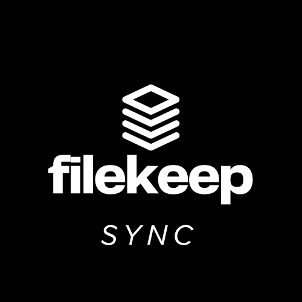

# FileKeep Sync — Local Folder Sync Service



**FileKeep Sync** is a lightweight Ruby application that keeps a local folder in sync with your FileKeep account. It runs as a background service on your machine, watches for file changes, and syncs them through the FileKeep web client to the FileKeep API and cloud storage.

This app is part of the [FileKeep](https://github.com/jayastronomic/filekeep-client) ecosystem, a Dropbox clone built for the [John Cricket Coding Challenge](https://codingchallenges.fyi/challenges/challenge-dropbox).

---

## ⚙️ How It Works

- 📁 Monitors a folder on your local machine for file changes.
- 🌐 Communicates with the FileKeep client (frontend) running in your browser.
- 🚀 Sends updates through the FileKeep client to the FileKeep API (backend).
- ☁️ Keeps your cloud drive in sync with your local changes.

---

## 🛠️ Prerequisites

- [Ruby](https://www.ruby-lang.org/en/downloads/) (v3.0+ recommended)
- [Bundler](https://bundler.io/) (for managing dependencies)

To check if Ruby is installed:

```bash
ruby -v
```

If not installed, follow the instructions for your platform at https://www.ruby-lang.org.

## 📦 Installation & Setup

### 🔁 Clone the Repo

```bash
git clone git@github.com:jayastronomic/filekeep-sync-service.git
cd filekeep-sync-service
```

### Install Dependencies

```bash
bundle install
```

### Start the sync service

```bash
bundle exec rackup
```

By default, the service runs at http://localhost:9292.

## 🌐 API Routes — FileKeep Sync

The FileKeep Sync local service provides a simple HTTP interface to start, stop, and check the status of the sync process.

This service runs locally at: `http://localhost:9292`

---

### `POST /start-sync`

**Starts the syncing process between your local folder and the FileKeep cloud.**

#### 📥 Request

- **Headers**

  - `Authorization`: Bearer token to authenticate the request

- **Body**

  ```json
  {
    "folderPath": "your/local/folder/path"
  }
  ```

### 📝 Notes

This initiates an immediate one-time sync.

It also starts a background job that continues to sync the folder every 5 seconds.

### `GET /stop-sync`

**Stops the ongoing background syncing process.**

#### 📤 Response

- `200 OK` on success

- **Body**

  ```json
  "Sync successfully stopped"
  ```

### `GET /sync-status`

**Returns the current sync status.**

#### 📤 Response

- `200 OK`

- **Body**

  ```json
  {
    "syncStatus": "on" | "off"
  }
  ```

### Important Notes

This service does not run in Docker. It's meant to be run locally on your machine.

The FileKeep frontend client must be running and connected to the FileKeep API for sync to work properly.

The sync logic is intentionally simple and designed for demo or development use.

## 🤝 Contributing

Pull requests are welcome! For major changes, please open an issue first to discuss what you’d like to change.

## 📄 License

This project is open-source and available under the [MIT License](LICENSE).
